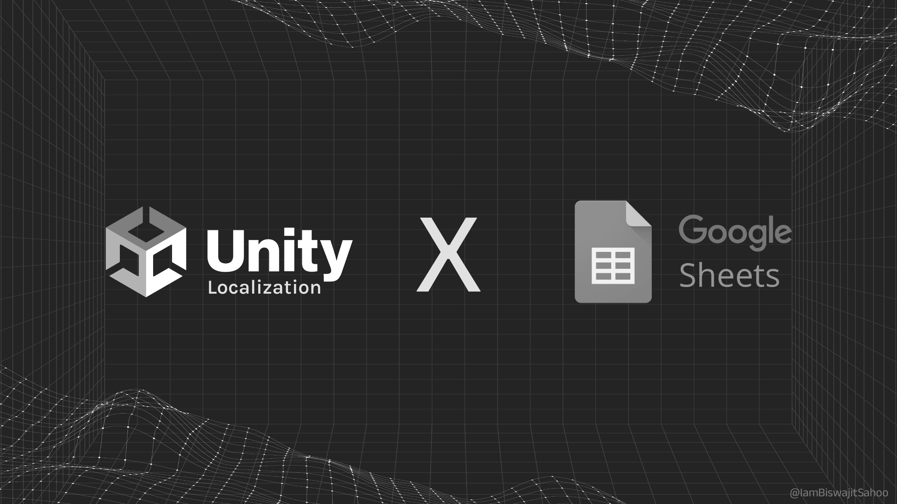

# Localization Google Sheets SA (Service Account)

---

# Instructions
## How to Setup a Google Cloud project with a service account

Follow these steps to create a Google Cloud project & a service account.

### Step 1: Create a Google Cloud Project

- Open the [Google Cloud Console](https://console.cloud.google.com/).
- Create a new project or select an existing one.
- This project will group your enabled APIs, service accounts, and billing for this integration. (You do not need billing unless you plan to use the google sheets API services beyond the free limit. )

### Step 2: Enable the Google Sheets API

- Navigate to **APIs & Services → Library**.
- Search for **Google Sheets API** and click **Enable**.

> ⚠️ This step is required before creating credentials or keys.

### Step 3: Create a Service Account

- Go to **IAM & Admin → Service Accounts → Create Service Account**.
- Give it a descriptive name, e.g., `localization-sheets-sa`.
- Assign minimal roles if needed; broad project roles are not required for basic spreadsheet access.

### Step 4: Create and Download a JSON Key

- In the Service Account details page:
    1. Click **Keys → Add Key → Create new key → JSON**.
    2. Download the file, e.g., `localization-sheets-sa-key.json`.

> ⚠️ Treat this file like a secret. Do not commit it to Git. Rotate or delete keys that are exposed.

### Step 5: Share Your Google Sheet

- Open your spreadsheet in Google Sheets.
- Click **Share**.
- Add the service account email: `localization-sheets-sa@YOUR_PROJECT_ID.iam.gserviceaccount.com`
- Grant **Editor** access if write access is needed, or **Viewer** for read-only.

> 🔑 Note: Sharing the spreadsheet is required; IAM permissions alone do not grant access.

### Step 6: Store the JSON Key Securely

- **CI / Server:** Store the JSON in your CI secret store (e.g., GitHub/GitLab/Bitbucket secrets, Google Secret Manager).
- **Local development:** Place the JSON in a secure folder and reference it in your project settings.
- Add the JSON file to `.gitignore` to avoid committing it.

> ⚠️ Rotate keys periodically and delete unused keys.

---

## Notes:

- Sharing the spreadsheet with the service account is usually enough for read/write access.
- Only grant additional IAM roles if your integration needs to create new spreadsheets programmatically.
- Unity’s built-in Google Sheets provider may require OAuth; service accounts are not supported out-of-the-box in some cases.

---

## Google Sheets Integration Setup (inside Unity)

