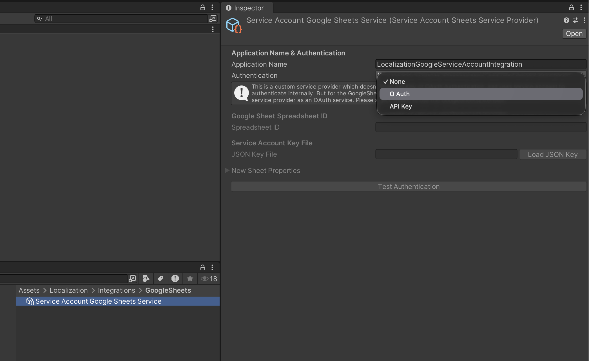

# Localization Google Sheets SA (Service Account)

---

# Instructions

---
### Watch it on Youtube

---

# Usage

1. Copy the github URL and install it in the package manager using `Git URL`.
   
   

2. Create the `ServiceAccountGoogleSheetProvider.asset`.
   

3. Set the Application Name as the name of the Google Sheet and set the Authentication Type to OAuth.
   > NOTE: **OAuth** is required for the Google Sheet Extension to allow this service provide asset to modify the google sheets from the extension buttons. Internally the asset uses service account key to authenticate.
   

4. Set the Spreadsheet ID and load the Service Account Key.
   > NOTE: Keep the service account key in a previate and secure location. DO NOT push it to any repository.
   

5. Add the asset to your string table's Google Sheet Extension and perform the same set of transaction the deafult Unity's `Google Sheets Service.asset` allows.
   

---

# Repository

GitHub Repo: [Unity Localization Google Sheets SA](https://github.com/IamBiswajitSahoo/UnityLocalizationGoogleSheetsSA#)

---

# Contributing

Issues and pull requests are welcome.
- Open an [issue](../../issues) for bugs, feature requests, or questions.
- Submit a [pull request](../../pulls) if you’d like to improve the plugin or documentation.

---

# License

This project is licensed under the [MIT License](LICENSE.txt).